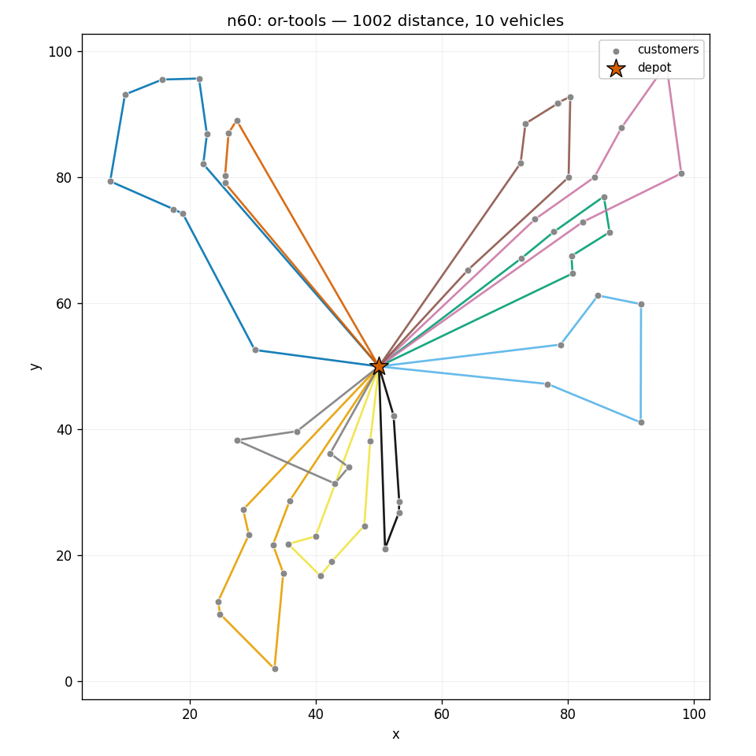
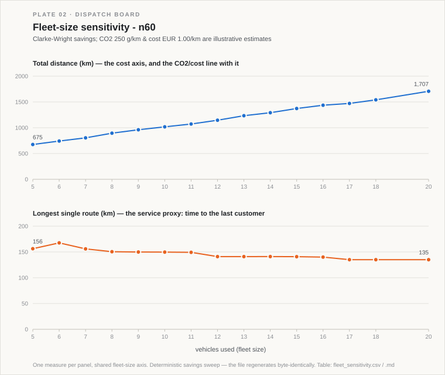

# route-optimizer

[](https://github.com/Dimitres-Kisimov/route-optimizer/actions/workflows/ci.yml)

This solves the last-mile routing problem a distributor actually faces every
morning: a depot, a list of customers with locations and order sizes, and a
fleet of capacity-limited vans — which van visits whom, in what order, so that
the total distance driven is as small as possible. Fewer kilometres is directly
fewer euros and less CO2, so the gap between a decent plan and a good one is
money. It is the **Capacitated Vehicle Routing Problem (CVRP)**, and it is
NP-hard, so the interesting question is not "can we solve it" but "how much does
a real optimizer beat the heuristic a dispatcher would reach for by hand?"

So I built both and measured. The baseline is the classic **Clarke-Wright savings**
algorithm (1964), written from scratch. The optimizer is **Google OR-Tools**'
CVRP solver with guided local search. The whole thing runs on CPU in seconds, on
synthetic-but-structured instances, with no API keys and nothing to download at
run time.



## The result

On the seeded 60-customer instance (448 units of demand, capacity-50 vans):

```
Nearest-neighbour        1,445.8   10 vehicles   (naive greedy sweep)
Clarke-Wright savings    1,046.2   10 vehicles   (the classic 1964 heuristic)
OR-Tools (GLS, 8s)         998.3   10 vehicles
```

**OR-Tools cut total distance 4.6% below Clarke-Wright savings, and 31% below a
naive nearest-neighbour sweep, in 8 seconds.** Both the savings baseline and the
solver parked 2 of the 12 available vans. That ~5% over an *already good* baseline
is the honest headline: savings is strong, and squeezing the last few percent out
of it is exactly what the metaheuristic is for. On the 100-customer instance the
gap is smaller (~1%) — the savings heuristic happens to find near-optimal
structure there, which is a fair thing to show rather than hide.

## Fleet-size sensitivity (what-if)

Cutting one instance is a point answer; a fleet planner works a curve. So there
is a second layer that asks *how big should the fleet be at all?* It sweeps the
sizing lever — **van capacity** (bigger vans ⇒ fewer vans) — with the
deterministic Clarke-Wright savings heuristic and reads off, for each resulting
fleet size, the total distance, the longest single route (a **service** proxy —
time to the last customer), and a labelled cost/CO2 line.



The honest finding is the direction. Because the model minimises distance with no
fixed per-van cost, **fewer, fuller vans win on both distance and CO2** — the
thing you trade away is service. On `n60` (`deliverables/fleet_sensitivity.csv`):

```
Operating point — 10 vans (capacity 51): 1,017.2 km, ~254.3 kg CO2, ~€1,017/round.
Consolidating 10 → 9 vans:  distance −5.6%, CO2 −5.6%, longest route +0.1% (service).
Leanest modelled 5 vans:    distance −33.7%, CO2 −33.7%, longest route +4.4% (service).
Adding a van 10 → 11:       distance +5.4%, CO2 +5.4%, longest route −0.3% (service).
```

So the "more vans = more driving" intuition is backwards here: **more vans buys
shorter routes (better service) at the cost of more total distance/CO2, not less.**
Cost is variable only (distance × €/km); a real fixed per-van cost would push the
optimum further toward consolidation. The **€1.00/km and 250 g/km factors are
illustrative estimates, not certified** — distance is straight-line synthetic-grid
units treated as km. Full table and the drawn frontier:
`deliverables/fleet_sensitivity.md` / `.csv` / `.svg`.

## Time windows & service level (VRPTW)

Capacity is not the only promise a distributor makes. Deliveries come with a
*window* — "before noon", "after 2pm" — and the base plan never looks at the
clock. So there is a third layer that adds **time windows** and asks the service
question: *how many promises does the time-blind plan already keep, and what does
guaranteeing the rest cost?*

On `n60` with synthetic morning / afternoon / anytime windows (labelled estimates:
an 8-hour day, 40 km/h, 5 min/stop):

- The **time-blind Clarke-Wright** plan keeps **41 of 60** windows (68%) — 19
  deliveries land late, the worst **107 minutes** past due. That audit is
  deterministic (`deliverables/service_audit.csv`).
- Giving the **same OR-Tools engine a time dimension** (the classic **VRPTW**)
  keeps **all 60** windows by construction, for **+1.2% distance** over the
  time-blind plan — 19 late deliveries fixed for barely more driving, because the
  better routing largely pays for the added constraint. (Held against the
  time-blind OR-Tools *optimum* rather than the savings plan, the intrinsic price
  of the window constraint is closer to ~5%.)

Full write-up: `deliverables/service_level.md`. The windows are **synthetic and
labelled**; the VRPTW distance comes from a time-limited metaheuristic, so it
wobbles a fraction of a percent between runs, while the on-time audit of the
deterministic savings plan does not.

## Run it

```bash
pip install ortools numpy matplotlib pandas
python data/generate_instances.py                              # seeded instances -> data/instances/
python -m routeopt --instance data/instances/n60.json --compare   # print all three methods + the gap
python -m routeopt --instance data/instances/n60.json --sweep-fleet  # fleet-size sensitivity (CSV+SVG+MD)
python -m routeopt --instance data/instances/n60.json --service   # time-window (VRPTW) service-level analysis
python web/build_data.py --instance data/instances/n60.json    # web/data.js -> open web/index.html offline
pytest -q                                                      # 26 tests, ~25s
```

`python -m routeopt --instance ...` also writes the deliverables:
`deliverables/route_plan.csv` (vehicle, stop order, load, cumulative distance),
`deliverables/routes.png`, and `deliverables/summary.md`. Knobs: `--metric
manhattan`, `--time-limit 20`, `--compare`, `--no-deliverables`.

Open `web/index.html` (no server needed) for the interactive map: depot,
customers and colored routes on a canvas, a metrics panel, a toggle to overlay
the savings-heuristic routes for visual comparison, and light/dark.

## How it works

The maths — the CVRP formulation, the savings algorithm, and the exact OR-Tools
setup (capacity + distance dimensions, `PATH_CHEAPEST_ARC` first solution,
guided local search) — is written out in [`docs/METHOD.md`](docs/METHOD.md).

- `data/generate_instances.py` — deterministic clustered instances (N ≈ 30/60/100
  plus a hand-checkable tiny one) with a depot, integer demands, capacity and fleet.
- `routeopt/model.py` — instance loading + the distance matrix.
- `routeopt/heuristic.py` — Clarke-Wright savings and nearest-neighbour, from scratch.
- `routeopt/solver.py` — the OR-Tools CVRP solver.
- `routeopt/report.py` — the CSV / PNG / summary deliverables.
- `routeopt/sensitivity.py` — the fleet-size / cost / service / CO2 what-if sweep.
- `routeopt/timewindows.py` — time windows (VRPTW) on the OR-Tools engine plus the
  deterministic on-time / service-level audit of the time-blind plan.

## Limitations

I would rather state these than oversell:

- **Synthetic instances.** Coordinates and demands are generated, not real orders.
  The generator clusters customers to look like service neighbourhoods, but it is
  still made-up data.
- **Euclidean distances, not roads.** Distance is straight-line (a Manhattan L1
  option exists as a crude grid proxy). A production system would use a road-network
  distance/time matrix from an OSRM/Valhalla-style engine, and the routes would shift.
- **Single depot, homogeneous fleet.** All vans are identical and start from one
  depot. Time windows *are* now modelled (the VRPTW / service-level layer above),
  but on **synthetic** windows, and a fixed per-stop service time. Multi-depot,
  heterogeneous fleets, driver shifts and variable service times are the next
  constraints, and OR-Tools supports all of them.
- **GLS is time-limited, so its final number wobbles** a fraction of a percent between
  runs. The baselines are deterministic; the headline gap is stable to within noise.

## License

© 2026 Dimitres Kisimov — all rights reserved; published for portfolio review. See LICENSE. Data is synthetic; OR-Tools is Apache-2.0. See
[CREDITS.md](CREDITS.md).
